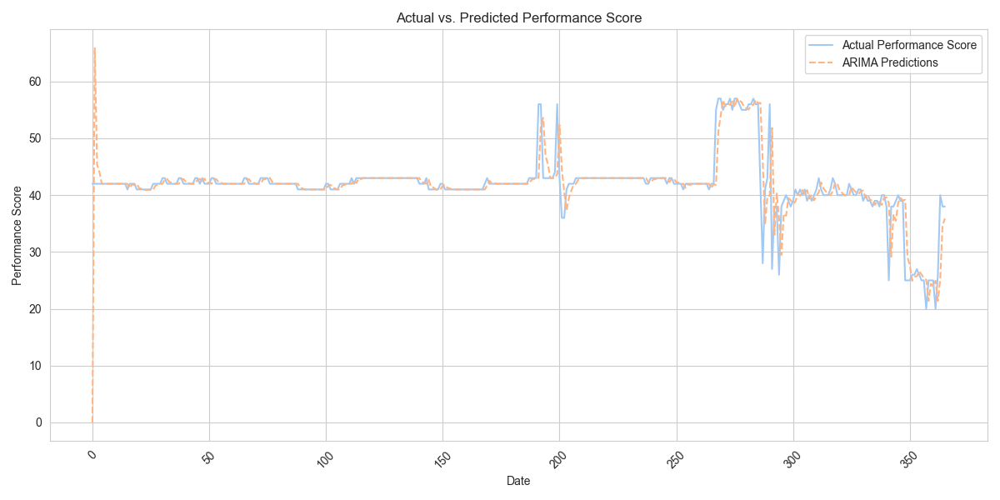

# Predicting Core Web Vitals Performance based on Website Characteristics

**Miguel Daniel Ramos Martinez**

#### Executive summary
This research project aims to develop predictive models for Core Web Vitals (LCP, INP, and CLS) by analyzing various website characteristics. By leveraging machine learning techniques and data from the Chrome User Experience Report, HTTP Archive, and Blue Triangle RUM, the study will identify key factors influencing website performance. The outcome will be actionable insights and tools that empower developers and website owners to optimize their sites for improved user experience and search engine rankings.

#### Rationale
Core Web Vitals are crucial metrics for evaluating website user experience, directly impacting search engine rankings and user satisfaction. Understanding the relationship between website attributes and these metrics allows for proactive optimization, leading to:

* Improved search engine visibility
* Enhanced user engagement and conversion rates
* Better overall website performance
* More efficient resource allocation for development teams
* Data-driven decision-making for technology choices

#### Research Question

Which measurable website attributes are the most significant predictors of Core Web Vitals (LCP, INP, and CLS) performance?
Which core web vitals affected the performance score more?

#### Data Sources
1.  Real User Monitoring (RUM) Data (Blue Triangle): Performance data specific to our client's website, potentially offering more granular insights and custom metrics beyond standard CrUX data. This can complement the CrUX data and provide a deeper understanding of our specific context.

## Data Understanding
<pre>
Data Set Characteristics:  Real Time Monitoring(RUM) year 2024
Area: Core Wev Vitals
Attribute Characteristics: Real
Missing Values? None
</pre>

#### Attribute Information:

<pre>
The btt_cwv_2024_df.csv dataset will be prioritized for analysis due to its comprehensive data coverage throughout 2024.

The subsequent phase of this project will involve examining the impact of browser, IPS, country, region, and traffic source on the Performance Score.

It is also important to note the absence of CLS data within the current dataset, which presents an opportunity to develop a predictive model specifically for this metric
</pre>

There are 8 CSV files.
- 6 files detail website performance across various dimensions (e.g., Browser, ISP, Country).
- 1 file contains Core Web Vitals data for the full year 2024.
- 1 file presents final performance metrics for the full year 2024, broken down by page.

The first 6 CSV files consist of:

**1. `performance_page_df`:**

* **Focus:** Detailed performance metrics **per page**.
* **Key Column:** `Page Name` (string).
* **Metrics:** This dataset includes 50 more granular pages by app, includes LCP and INP breakdown metrics in milliseconds and percentages (e.g., `LCP Time to First Byte (ms)`, `INP Input Delay (ms)`). It also directly includes `Interaction to Next Paint (s)` which aligns with the evolving Core Web Vitals.
* **Potential Use:** Pinpoint performance bottlenecks on specific pages. The detailed LCP and INP metrics can help diagnose exactly where delays are occurring (e.g., time to first byte, resource loading, rendering). This is crucial for targeted optimization efforts.

**2. `browser_df`:**

* **Focus:** Performance metrics segmented by **browser**.
* **Key Column:** `Browser` (string).
* **Metrics:** Contains standard page load metrics (Onload, First Byte, LCP, INP, CLS, etc.) along with network timings (TCP, DNS, SSL, Redirect).
* **Potential Use:** Identify browser-specific performance issues. For example, are certain browsers experiencing significantly slower load times or higher CLS? This could guide browser-specific optimizations.

**3. `country_df`:**

* **Focus:** Performance metrics segmented by **country**.
* **Key Column:** `Country` (string).
* **Metrics:** Similar set of page load and network timing metrics as `browser_df`.
* **Potential Use:** Understand geographical performance variations. Are users in certain countries experiencing slower loading times? This could indicate issues with CDN coverage, network infrastructure in those regions, or the need for localized content.

**4. `isp_df`:**

* **Focus:** Performance metrics segmented by **Internet Service Provider (ISP)**.
* **Key Column:** `ISP` (string).
* **Metrics:** Again, the same core set of performance and network metrics.
* **Potential Use:** Identify performance issues related to specific ISPs. While less common, certain ISPs might have routing or network congestion that impacts user experience. This could be useful for troubleshooting specific user reports.

**5. `region_df`:**

* **Focus:** Performance metrics segmented by **region**.
* **Key Column:** `Region` (string).
* **Metrics:** Similar to `country_df`, but likely at a more granular geographical level.
* **Potential Use:** Analyze performance variations within a country or across different regions. This can help identify regional infrastructure or content delivery issues.

**6. `traffic_source_df`:**

* **Focus:** Performance metrics segmented by **traffic source**.
* **Key Column:** `Traffic Source` (string).
* **Metrics:** Contains the standard set of performance and network metrics.
* **Potential Use:** Understand if users arriving from different sources (e.g., organic search, social media, direct) experience different performance. This could indirectly point to landing page optimization needs or the quality of the traffic.

2 more CSV files consist of -

**7. `performance_2024_df`:**

* **Focus:** Summary of performance metrics **per page**, seemingly for 2024
* **Key Columns:** `Page Name` (string).
* **Metrics:** Final year metrics as `performance_page_df` but the whole pages no just the top fithty
* **Potential Use:** Analyze historical performance trends for specific pages. This allows for tracking the impact of performance optimizations over time or identifying regressions.

**8. `btt_cwv_2024_df`:**

* **Focus:** Website performance metrics collected over a period of 1 year. Each row represents data for a specific day of the year, capturing various aspects of page load speed and user experience.

* **Key Column:** 

  - `INP (s)` (float64).
  - `Largest Contentful Paint (s)` (float64).
  - `Cumulative Layout Shift` (float64).
  - `First Contentful Paint (s)` (float64).
  - `Total Blocking Time (s)` (float64).
* **Metrics:** Data for a specific day of the year of CWV and principal features driving performance.
* **Potential Use:** Calculate the Performance Score (weighted average of the individual metric).

### Define weights

We will be using Lighthouse 10 as our baseline, replacing the Speed Index (which has a 10% weight) with INP, the Speed Index data is unavailable.

| Metric                     | Weight |
|----------------------------|--------|
| First Contentful Paint     | 10%    |
| Interaction to Next Paint  | 10%    |
| Largest Contentful Paint   | 25%    |
| Total Blocking Time        | 30%    |
| Cumulative Layout Shift    | 25%    |

**Key Considerations:**

* **Mobile Only:** Focus on Mobile Web, data is not a covert desktop experience.
* **Units:** Note that most time-based metrics are in seconds (s).
* **Dataset Focus:** Your analysis will primarily revolve around understanding page-level performance using the detailed metrics available in btt_cwv_2024.csv

**Key Differences and Argument for Separate Datasets:**

* **Granularity of Analysis:** Each dataset allows for a different level of analysis. Some focus on user segments (browser, country, ISP, region, traffic source), while others focus on specific content (pages).
* **Identification of Root Causes:** Segmenting performance data by these dimensions helps pinpoint the *source* of performance issues. A slow LCP might be prevalent in a specific country, suggesting a CDN issue, or it might be isolated to a particular page, indicating a problem with that page's assets or code.
* **Targeted Optimization:** By understanding *who* is experiencing performance issues and *where* they are occurring, optimization efforts can be more targeted and efficient.
* **Different Questions:** Each dataset is designed to answer different questions about website performance.

#### Methodology

The `Capstone(EDA).ipynb` notebook implements the CRISP-DM framework, including:

* **Data Acquisition and Preparation:** Collection, cleaning, integration, and preprocessing of data from CrUX, HTTP Archive, and Blue Triangle RUM. The notebook demonstrates handling of missing values and data consistency.
* **Feature Engineering:** Derivation of new features (e.g., total resource sizes, resource ratios, DOM complexity) from the raw data, as detailed in the notebook.
* **Exploratory Data Analysis (EDA):** The notebook contains visualizations (histograms, scatter plots, box plots, etc.) to understand data distributions, identify relationships, and detect potential issues like outliers.
* **Regression Analysis, Time Series Analysis, and Forcasting:** Implementation of Linear Regression as a Baseline model and potentially Random Forest Regression to predict Core Web Vitals. The notebook shows the model building and evaluation process.
* **Model Evaluation:** The notebook calculates Mean Squared Error (MSE), Root Mean Squared Error (RMSE), and R-squared to assess model performance. **A clear rationale for the selection and use of these evaluation metrics is provided within the notebook.** The interpretation of these metrics in the context of the prediction task is also detailed there.
* **Analysis and Interpretation:** Identification of significant predictors and interpretation of model results, presented clearly in the notebook. Clustering analysis (if performed) will also be detailed there.

#### Results
* (The findings of the research, including the **valid interpretation of the evaluation metrics**, will be detailed in the [Capstone](Capstone.ipynb) notebook.)
* Key website attributes impacting LCP, INP, and CLS will be identified in the notebook.
* Quantification of relationships between attributes and Core Web Vitals will be presented in the notebook.
* Model predictive accuracy will be evaluated and shown in the notebook.
* Insights into website performance patterns and optimization areas will be discussed in the notebook.
* Clustering results (if applicable) will be visualized and explained in the notebook.

#### Next steps
* Refine the predictive models based on the initial results.
* Explore additional machine learning techniques.
* Investigate the impact of specific website technologies in more detail.
* Develop a tool or dashboard to visualize the relationships between website attributes and Core Web Vitals.
* Validate the findings with a larger and more diverse dataset.
* Apply the models to predict Core Web Vitals for a wider range of websites.
* Develop recommendations and best practices for website optimization based on the research findings.

#### Outline of the project

- [Linear Regression and Random Forest](Capstone.ipynb)
- [TimeSeries](TimeSeries.ipynb)

##### Contact and Further Information
[Linkedin](https://www.linkedin.com/in/mdrmtz/)
Founder | Technical Leader | AI/ML | Product Owner | Web Performance | Google Cloud | Agile | Consulting Services | International Speaker
