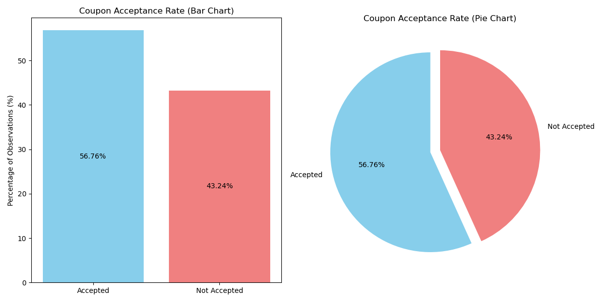
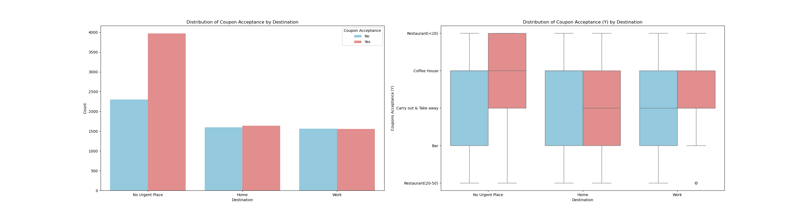

# Amazon's Coupon Strategy

This [Practical Application 1](**Practical%20Application%201.ipynb**) examines Amazon's proposed strategy of leveraging driver route data to send targeted coupons, aiming to drive customer traffic to local businesses. By employing machine learning (ML) techniques, the project evaluates the feasibility of this approach, building predictive models to determine the likelihood of coupon acceptance.

---

## Project Overview

Amazon envisions using real-time driver route information to deliver targeted coupons to individuals who are likely to be interested in nearby businesses. This strategy benefits:

- **Amazon**:
  - Increased customer engagement
  - Valuable data collection on consumer behavior
  - Potential advertising revenue from local businesses

- **Local Businesses**:
  - Increased foot traffic and sales
  - Stronger partnerships with Amazon

The project incorporates ML techniques to enhance targeting accuracy and campaign effectiveness. Specific coupon types, such as bar coupons and coffee house coupons, are analyzed, with practical applications detailed in the analysis of coffee house coupon acceptance.

---

## Data Description

The dataset originates from the UCI Machine Learning Repository and was collected via a survey on Amazon Mechanical Turk. The survey presented driving scenarios and gauged participants' willingness to accept coupons for various businesses. Attributes in the dataset include:

### User Attributes:
  -  gender: male, female
  -  age: below 21, 21 to 25, 26 to 30, etc.
  -  maritalStatus: Marital Status with values single, married partner, unmarried partner, or widowed
  -  has_children: Number of children with values 0, 1, or more than 1
  -  education: high school, bachelors degree, associates degree, or graduate degree
  -  occupation: architecture & engineering, business & financial, etc.
  -  income: Annual income with values less than \$12500, \$12500 - \$24999, \$25000 - \$37499, etc.
  -  Bar: Number of times that he/she goes to a bar: 0, less than 1, 1 to 3, 4 to 8 or greater than 8
  -  CarryAway: Number of times that he/she buys takeaway food: 0, less than 1, 1 to 3, 4 to 8 or greater
  than 8
  -  CoffeeHouse: Number of times that he/she goes to a coffee house: 0, less than 1, 1 to 3, 4 to 8 or
  greater than 8
  -  RestaurantLessThan20: Number of times that he/she eats at a restaurant with average expense less than \$20 per
  person: 0, less than 1, 1 to 3, 4 to 8 or greater than 8
  - Restaurant20To50: Number of times do you go to a restaurant with average expense per person of \$20 - \$50 every month.

### Contextual Attributes:
  - destination: Driving destination with values home, work, or no urgent destination
  - weather: sunny, rainy, or snowy
  - temperature: 30F, 55F, or 80F
  - time: 10AM, 2PM, or 6PM
  - passanger: Passenger with values alone, partner, kid(s), or friend(s)
  - car: Info about the car being drive.
  - toCoupon_GEQ15min: Driving distance to the restaurant/bar for using the coupon is greater than 15 minutes, values 0, 1
  - toCoupon_GEQ25min: Driving distance to the restaurant/bar for using the coupon is greater than 25 minutes, values 0, 1
  - direction_same: Whether the restaurant/bar is in the same direction as your current destination, values 0, 1
  - direction_opp: Whether the restaurant/bar is in the same direction as your current destination, values 1, 0

### Coupon Attributes:
  - expiration: time before it expires: 2 hours or one day
  - y: accept the coupon:
    - "Right away",“Later, before the coupon expires" 1
    - "No, I do not want the coupon" 0
  - coupon: type of coupon with values Restaurant(<\$20), Coffee House, Carry out & Take away, Bar, Restaurant(\$20-\$50)

---

## Key Insights

### 1. **Overall Coupon Acceptance Rate**
- **Acceptance**: 56.76%
- **Non-Acceptance**: 43.24%

This suggests a general openness among drivers to consider coupons.

### 2. **Travel Patterns and Destination**
- Drivers are more likely to accept coupons for businesses along their intended route, especially with flexible destinations like "No Urgent Place."

- Strong positive correlation (0.44) between destination alignment and coupon acceptance.
- Moderate positive correlation (0.41) between long driving distances (>25 minutes) and coupon acceptance.

### 3. **Coffee House Coupon Exploration**

The analysis investigates various factors influencing coffee house coupon acceptance:

- **Passenger Type**: Solo travelers tend to have lower acceptance rates.
- **Time of Day**: Coupon acceptance peaks in the morning and afternoon.
- **Age**: Both younger and older adults show higher receptiveness to coupons.
- **Expiration Time**: Shorter expiration times lead to higher acceptance rates.
- **Income**: Individuals with lower income are more likely to accept coupons.

### 4. **Demographics and Social Habits**
- **Receptive Groups**: An percentage (72.17%) of the younger drivers (under 30 years) who frequent bars are accepting the coupons. This suggests that younger drivers are more likely to accept bar-related promotions whenever they go out more than once a month.

   

 
- **Social Influence**: Drivers who go to bars more than once a month, have passengers that are not kids, and are not widowed:**

   The score of this group is much higher than that of the general group, with 77.49% for this group and 37.16% for the general group.

   

---

## Recommendations and Next Steps

### A. **Develop Predictive Models**
- **Utilize ML**: Build predictive models using user demographics, contextual attributes (e.g., time, destination), and coupon details to predict acceptance likelihood.
- **Target High-Responders**: Focus marketing efforts on individuals with a high predicted probability of acceptance, optimizing campaign efficiency and ROI.

### B. **Expand Data Collection and Analysis**
- **Granular Data**: Include customer purchase history, loyalty program activity, browsing behavior, and external factors like weather and traffic patterns.
- **Sentiment Analysis**: Use customer reviews and social media data to assess sentiment toward businesses and coupons for more tailored offers.

### C. **Enhance Coupon Design and Delivery**
- **Personalization**: Tailor coupon content to individual preferences, such as offering coffee house discounts based on past purchases.
- **Delivery Channels**: Experiment with methods like:
  - Push notifications via Amazon's mobile app
  - Location-based alerts near participating businesses
  - Personalized email campaigns
- **Gamification**: Introduce loyalty programs or rewards for repeated coupon redemptions to boost engagement.

## Conclusion

Amazon's proposed strategy of leveraging driver route data for targeted coupon delivery presents significant opportunities for both Amazon and local businesses. By integrating ML, expanding data collection, and optimizing coupon design, Amazon can enhance targeting precision, increase acceptance rates, and drive traffic to local businesses. Addressing privacy concerns and scaling personalization are critical to ensuring ethical and effective implementation.
