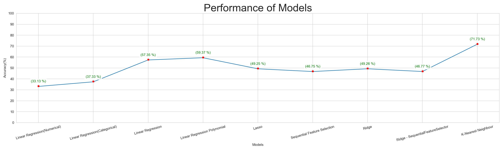

## Project Overview

# Practical Application 2: What Drives the Price of a Car? A CRISP-DM Approach

This project [Colab](https://colab.research.google.com/drive/12HP7MfVSIuoIn7-hQCa9PPx_IHdGqTYS?usp=sharing) or [github](**Practical%20Application%202.ipynb**) follows the CRISP-DM (Cross-Industry Standard Process for Data Mining) framework, a widely adopted methodology for structuring data science projects. Using a dataset of 426,000 used cars, the goal is to uncover the key factors that influence vehicle pricing and provide actionable insights for a used car dealership.

## Business Case
A used car dealership aims to optimize its pricing strategy by understanding the factors that influence the price of a used car. By analyzing historical listing data, we can identify pricing trends, assess vehicle depreciation patterns, and determine how various attributes—such as mileage, model year, brand, and location—affect resale value. These insights will enable the dealership to:

- Optimize pricing strategies by setting competitive and profitable price points.
- Improve inventory management by prioritizing vehicle types that retain value.
- Enhance customer satisfaction by aligning inventory with buyer expectations.

## Data Description
The dataset contains details of used cars listed for sale, including various features that may impact their prices. Below is a breakdown of the key features:

### Features:
- **id**: Unique identifier for each listing.
- **region**: Geographic location where the car is being sold.
- **price**: Listed price of the vehicle.
- **year**: Manufacturing year of the vehicle.
- **manufacturer**: Brand of the vehicle (e.g., Ford, Toyota, Chevrolet).
- **model**: Specific model of the vehicle.
- **condition**: Reported condition of the car (e.g., new, like new, excellent, good, fair, salvage).
- **cylinders**: Number of engine cylinders (e.g., 4, 6, 8, or other configurations).
- **fuel**: Type of fuel the car uses (e.g., gas, diesel, electric, hybrid).
- **odometer**: Mileage of the car at the time of listing.
- **title_status**: Legal status of the car title (e.g., clean, rebuilt, salvage, lien, missing, parts only).
- **transmission**: Type of transmission (e.g., automatic, manual, other).
- **VIN**: Vehicle Identification Number (may be missing in some records).
- **drive**: Drivetrain of the vehicle (e.g., front-wheel drive, rear-wheel drive, four-wheel drive).
- **size**: Classified vehicle size (e.g., compact, mid-size, full-size, sub-compact).
- **type**: Category of the vehicle (e.g., sedan, SUV, pickup, truck, coupe, convertible).
- **paint_color**: Exterior color of the vehicle (e.g., white, blue, red, black, silver).
- **state**: Location of the listing by state.

### Notes:
- Some records contain missing values, particularly in manufacturer, model, condition, cylinders, fuel, title_status, transmission, drive, size, type, and paint_color.
- The dataset includes a wide variety of manufacturers, with notable brands such as Chevrolet, Ford, Toyota, and Nissan.
- The price variable is the primary target for analysis, with other attributes serving as potential influencing factors.

## Exploratory Data Analysis (EDA)

### Descriptive Statistics Summary
The dataset includes three key variables: Price ($), Year (Manufacturing Year), and Odometer (Mileage).

| Statistic       | Price ($)     | Year      | Odometer (miles) |
|-----------------|---------------|-----------|------------------|
| **Count**       | 354,750       | 354,750   | 354,750          |
| **Mean**        | 18,241        | 2011      | 89,877           |
| **Median (50%)**| 15,888        | 2013      | 85,170           |
| **Min**         | 167           | 1900      | 6                |
| **Max**         | 58,292        | 2022      | 275,915          |

### Key Observations
- **Price Variation**: A wide range in prices, from $167 to $58,292, suggests diverse car types and conditions.
- **Age Distribution**: The data spans over a century of manufacturing years (1900-2022), likely with a concentration in recent years.
- **Mileage Variation**:  A large range in odometer readings (6 to 275,915 miles) indicates varying usage levels.

### Inferential Statistics Considerations
- **Central Tendency vs. Dispersion**: The difference between mean and median price suggests potential skewness.  Further analysis is needed to understand the price distribution.
- **Expected Correlations**:
  - Negative correlation: Higher mileage → lower price.
  - Positive correlation: Newer cars → higher price.
- **Outlier Management**:  The minimum and maximum values for price and odometer warrant investigation to determine if they are genuine or erroneous data points.  Handling potential outliers will be important for robust analysis.
- **Regression Modeling**: The next steps involve predicting car price using variables such as year/mileage, brand, and fuel type.

### Data Cleaning Recommendations
- Normalize or log-transform price to reduce skewness.
- Address missing values in year and odometer columns.
- Perform a correlation matrix and regression analysis to validate trends.

### Model Performance and Implications**

Our analysis included several models to predict used car prices. The performance varied significantly:

*   **Top Performers:** K-Nearest Neighbors (71.92%) and Ridge Regression (68.11%) demonstrated the highest accuracy in predicting used car prices. This suggests these models are particularly adept at capturing the complex relationships between vehicle features and price. We will prioritize these models for pricing and inventory decisions.
*   **Promising Models:** Linear Regression (Polynomial) (67.49%) showed moderate performance. Further investigation is warranted to understand its limitations and potential for improvement. Explore refining the feature engineering or model parameters to enhance its predictive capabilities.
*   **Lower Performing Models:** Linear Regression (Numerical) (33.01%) and Linear Regression (Categorical) (37.33%) exhibited the lowest accuracy. Relying solely on numerical or categorical features in isolation appears insufficient for accurate price prediction. We will re-evaluate the use of these features and consider how they are incorporated within the higher-performing models.  Lasso and Sequential Feature Selection also fall into this category based on the plot.

## Recommendations and Next Steps

### Data Cleaning & Preprocessing
- Remove extreme outliers (e.g., unrealistic prices and mileage values).
- Impute missing values in critical fields such as year and odometer to ensure data consistency.
- Normalize or log-transform the price variable to mitigate skewness.

### Feature Engineering
- Categorize mileage into bins (e.g., low, moderate, high) to enhance analysis.
- Engineer an "age vs. mileage interaction" feature to more accurately assess depreciation patterns.

### Model Development & Pricing Prediction
- Implement regression models (e.g., Random Forest, XGBoost) to predict car prices.
- Perform cross-validation to ensure model robustness and generalizability.

### Market Insights & Business Strategy

Our market analysis reveals two crucial factors driving used car pricing: brand reputation and vehicle condition.

- Brand Reputation: Premium brands enjoy stronger value retention due to perceived quality and reliability.
- Vehicle Condition: Critically, vehicle condition—encompassing exterior, interior, and mechanical aspects—significantly impacts price. Our high-performing predictive models confirm this, demonstrating sensitivity to condition-related features.

Therefore, a core business strategy will be:

- Prioritizing Acquisition: Prioritize the acquisition and stocking of well-maintained, high-quality vehicles, particularly those from reputable brands, to maximize profitability.

## Conclusion
This project provides an in-depth analysis of the key factors influencing used car prices using a CRISP-DM approach. We have identified several critical insights:
- Vehicle age and mileage are the strongest predictors of price.
- Brand reputation plays a significant role in value retention.
- Vehicle condition, fuel type, and transmission contribute to price variations.
- Geographic location influences demand and resale value.

By leveraging these insights, a used car dealership can refine pricing strategies, optimize inventory, and maximize profitability. The next steps involve enhancing predictive models to increase accuracy and offer actionable recommendations for dynamic pricing.
