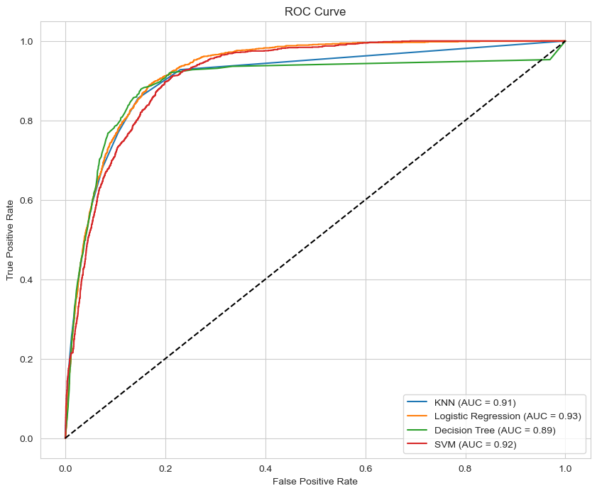

## Project Overview

# Practical Application 3: Comparing Classifiers

In this [Practical Application 3](Practical%20Application%203.ipynb) , your goal is to compare the performance of the classifiers we encountered in this section, namely K Nearest Neighbor, Logistic Regression, Decision Trees, and Support Vector Machines.  We will utilize a dataset related to marketing bank products over the telephone.

## Business Case

The Business Objective of the data mining task, as stated in the paper, is to increase the efficiency of directed marketing campaigns for long-term bank deposit subscriptions by identifying a model that can explain the success of a contact (i.e., if the client subscribes to the deposit) and subsequently reduce the number of contacts needed while maintaining a similar number of successes. This involves understanding the main characteristics that affect success, which will help in better managing available resources and selecting a high-quality set of potential buying customers

## Data Description
The dataset contains details of used cars listed for sale, including various features that may impact their prices. Below is a breakdown of the key features:

### Features:
```
1 - age (numeric)
2 - job : type of job (categorical: 'admin.','blue-collar','entrepreneur','housemaid','management','retired','self-employed','services','student','technician','unemployed','unknown')
3 - marital : marital status (categorical: 'divorced','married','single','unknown'; note: 'divorced' means divorced or widowed)
4 - education (categorical: 'basic.4y','basic.6y','basic.9y','high.school','illiterate','professional.course','university.degree','unknown')
5 - default: has credit in default? (categorical: 'no','yes','unknown')
6 - housing: has housing loan? (categorical: 'no','yes','unknown')
7 - loan: has personal loan? (categorical: 'no','yes','unknown')
# related with the last contact of the current campaign:
8 - contact: contact communication type (categorical: 'cellular','telephone')
9 - month: last contact month of year (categorical: 'jan', 'feb', 'mar', ..., 'nov', 'dec')
10 - day_of_week: last contact day of the week (categorical: 'mon','tue','wed','thu','fri')
11 - duration: last contact duration, in seconds (numeric). Important note: this attribute highly affects the output target (e.g., if duration=0 then y='no'). Yet, the duration is not known before a call is performed. Also, after the end of the call y is obviously known. Thus, this input should only be included for benchmark purposes and should be discarded if the intention is to have a realistic predictive model.
# other attributes:
12 - campaign: number of contacts performed during this campaign and for this client (numeric, includes last contact)
13 - pdays: number of days that passed by after the client was last contacted from a previous campaign (numeric; 999 means client was not previously contacted)
14 - previous: number of contacts performed before this campaign and for this client (numeric)
15 - poutcome: outcome of the previous marketing campaign (categorical: 'failure','nonexistent','success')
# social and economic context attributes
16 - emp.var.rate: employment variation rate - quarterly indicator (numeric)
17 - cons.price.idx: consumer price index - monthly indicator (numeric)
18 - cons.conf.idx: consumer confidence index - monthly indicator (numeric)
19 - euribor3m: euribor 3 month rate - daily indicator (numeric)
20 - nr.employed: number of employees - quarterly indicator (numeric)

Output variable (desired target):
21 - y - has the client subscribed a term deposit? (binary: 'yes','no')
```

### Notes:

- Client subscribed Just 11.27% said 'yes'. This data is very skewed, so we will need to balance the train and test data


### Model Performance and Implications**

The table below summarizes the improvement in test accuracy observed after tuning the hyperparameters for each classifier:

| Classifier          | Default Accuracy | Tuned Accuracy | Improvement |
|---------------------|------------------|----------------|-------------|
| KNN                 | ~0.896           | 0.902          | +0.006      |
| Logistic Regression | ~0.905           | 0.907          | +0.002      |
| Decision Tree       | ~0.886           | 0.907          | +0.021      |
| SVM                 | ~0.905           | 0.907          | +0.002      |




## Interpretation of the ROC Curve

The Receiver Operating Characteristic (ROC) curve visually represents the performance of a binary classifier by plotting the True Positive Rate (TPR) against the False Positive Rate (FPR) at various classification thresholds.

* **True Positive Rate (TPR) / Sensitivity / Recall:** This metric measures the proportion of actual positive cases (clients who subscribed) that were correctly identified by the model. A higher TPR indicates a better ability to detect positive instances.
* **False Positive Rate (FPR) / Specificity (1 - Specificity):** This metric measures the proportion of actual negative cases (clients who did not subscribe) that were incorrectly classified as positive. A lower FPR indicates fewer false alarms.

**AUC Score:** The Area Under the Curve (AUC) provides a single numerical value summarizing the overall performance of a classifier across all possible threshold values. It represents the probability that the classifier will rank a randomly chosen positive instance higher than a randomly chosen negative instance.

* An AUC of **1.0** indicates a perfect classifier.
* An AUC of **0.5** represents a classifier performing no better than random chance.

**Classifier Comparison based on ROC Curve:**

* **Logistic Regression:** Exhibits the highest AUC score of **0.93**, suggesting it is the most effective classifier among the four in distinguishing between clients who will and will not subscribe. Its ROC curve is positioned higher and further to the left compared to the others.
* **SVM:** Achieves the second-highest AUC score of **0.92**, indicating strong performance, very close to that of Logistic Regression.
* **KNN:** Shows an AUC score of **0.91**, demonstrating good performance, although slightly lower than Logistic Regression and SVM.
* **Decision Tree:** Presents the lowest AUC score of **0.89** among the compared classifiers, indicating it is the weakest performer in terms of its ability to discriminate between the two classes. Its ROC curve is generally lower than the other models, particularly in the lower FPR range.

**Random Guess Baseline:** The dashed black line on the plot represents the performance of a purely random classifier (AUC = 0.5). All the evaluated models significantly outperform random guessing, as their ROC curves are well above this baseline.

**In summary:** Based on the ROC curve and AUC scores, **Logistic Regression** and **SVM** demonstrate the best performance on this dataset, with **Logistic Regression** slightly outperforming **SVM**. **KNN** shows reasonable performance, while the **Decision Tree** appears to be the least effective in this comparison.

## Recommendations and Next Steps

### Combine Accuracy and ROC/AUC Insights:

* **Cross-reference metrics:** While the ROC curve and AUC provide insights into the ranking ability of the models, it's crucial to consider the test accuracy alongside these metrics for a comprehensive evaluation.
* **High AUC and Accuracy:** The fact that Logistic Regression and SVM have the highest AUC scores (0.93 and 0.92 respectively) and also show relatively high test accuracy (around 0.907) reinforces their potential as good models for this task.
* **Lower AUC and Accuracy:** The Decision Tree's lower AUC (0.89) aligns with its potentially lower ability to correctly classify instances, even though its tuned accuracy reached 0.907. Further investigation into other metrics might be needed.
* **KNN Performance:** KNN's moderate AUC (0.91) and accuracy (0.902) place it in the middle.

### Further Actions Based on Combined Analysis:

* **Fine-tune top performers:** Given the strong performance of Logistic Regression and SVM, further optimization of their hyperparameters using techniques like `RandomizedSearchCV` could potentially yield even better results.
* **Explore feature scaling for SVM:** Investigate the impact of different feature scaling methods (e.g., StandardScaler, MinMaxScaler) on the performance of the SVM model, as SVM can be sensitive to the scale of the input features.
* **Investigate Decision Tree performance:** Analyze why the Decision Tree achieved a similar accuracy to other models despite having a lower AUC. This could involve examining feature importance or potential overfitting.

### Consider Additional Evaluation Metrics:

As mentioned earlier, especially with imbalanced datasets, relying solely on accuracy can be misleading. Calculating and analyzing other metrics like:

* **Precision:** The proportion of correctly predicted positive cases out of all predicted positive cases.
* **Recall:** The proportion of correctly predicted positive cases out of all actual positive cases (same as TPR).
* **F1-score:** The harmonic mean of precision and recall, providing a balanced measure of the model's performance.
* **Confusion Matrix:** A table that summarizes the performance of a classification model by showing the counts of true positives, true negatives, false positives, and false negatives.

### Feature Importance Analysis:

For models like Logistic Regression and Decision Trees, explore feature importance techniques to understand which features have the most significant influence on the prediction of term deposit subscriptions. This can provide valuable business insights into the factors driving customer decisions. For Logistic Regression, you can examine the coefficients of the features. For Decision Trees, you can look at the feature importance scores provided by the model.

## Conclusion

Based on the analysis, **Logistic Regression** and **SVM** appear to be the most promising classifiers for predicting whether a client will subscribe to a term deposit in this bank marketing dataset.

**Key takeaways:**

* **Superior Ranking Ability:** Logistic Regression achieved the highest AUC score (**0.93**), closely followed by SVM (**0.92**), indicating their superior ability to correctly rank potential subscribers compared to non-subscribers.
* **Reasonable Test Accuracy:** All models demonstrated reasonable test accuracy after hyperparameter tuning (ranging from approximately 0.902 to 0.907), suggesting they can generally classify the majority of cases correctly.
* **Decision Tree Limitations:** The Decision Tree, despite reaching a similar accuracy after tuning, had the lowest AUC (**0.89**), suggesting it might be less reliable in distinguishing between the two classes compared to the other models. KNN performed moderately well with an AUC of **0.91**.
* **Further Investigation Recommended:** Further steps involving fine-tuning the top-performing models, exploring other evaluation metrics, and analyzing feature importance are recommended to gain a deeper understanding and potentially improve the predictive capabilities.
